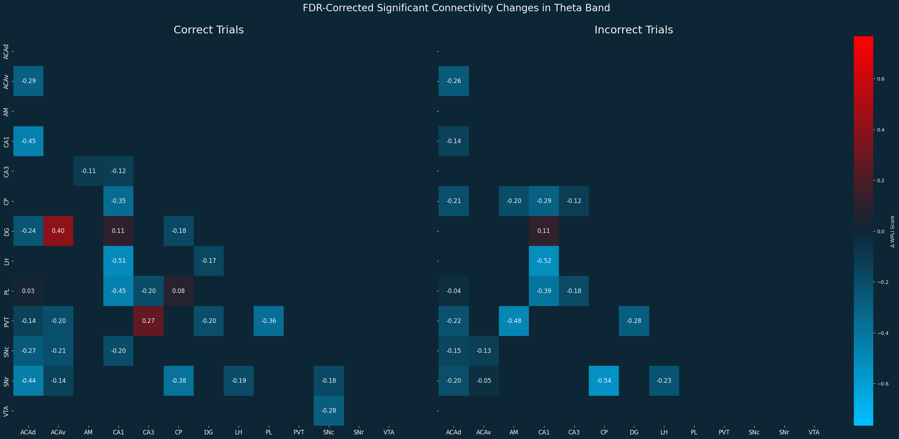
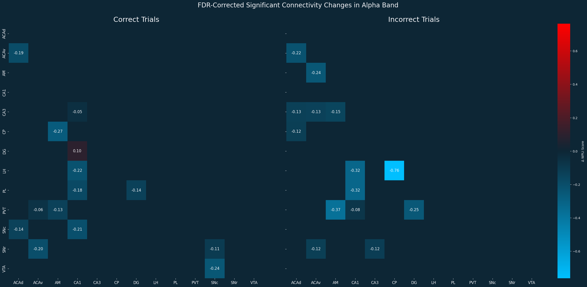
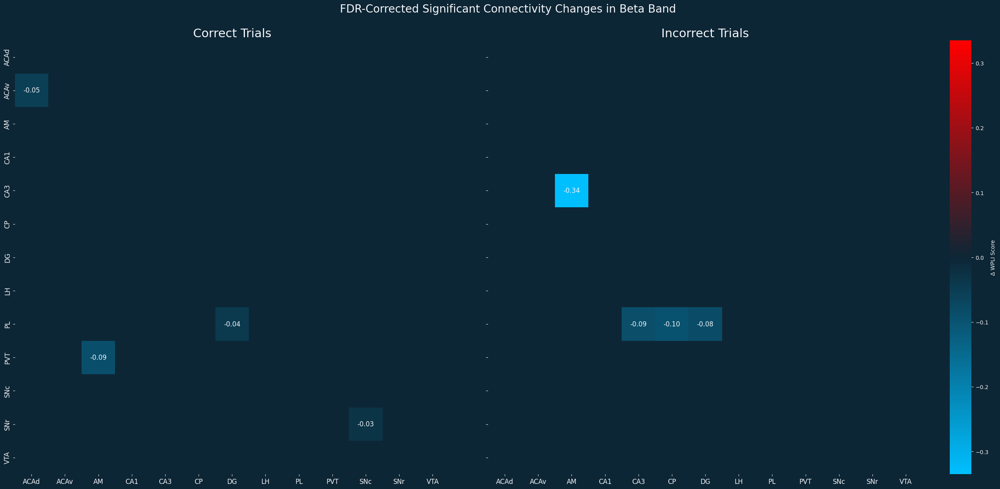
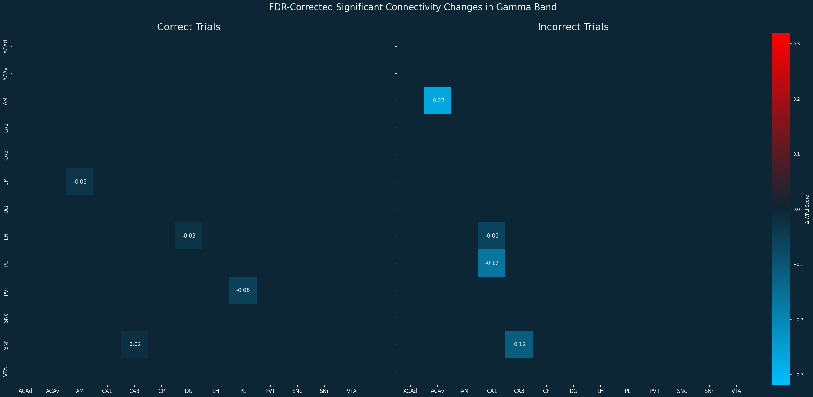

# Tracking Reward Circuit Connectivity Around Feedback in Perceptual Decision-Making: Insights from IBL Neuropixels Data

## Project Overview

This project investigates the dynamics of functional connectivity within the brain's reward circuit in response to feedback during a perceptual decision-making task. Utilizing the comprehensive, high-resolution Neuropixels dataset from the International Brain Laboratory (IBL) brain-wide map, we analyze how communication between key reward-related brain regions changes immediately before and after a subject receives feedback (i.e., correct or incorrect).

The core of this analysis is the application of the Weighted Phase Lag Index (WPLI), a robust measure of phase synchronization that minimizes spurious correlations caused by volume conduction. By examining WPLI in different frequency bands, we aim to uncover the neural signatures of feedback processing and adaptive learning.

---

## Research Question and Hypothesis

**Research Question:** How does functional connectivity across the reward circuit and associated areas change before and after feedback during a perceptual decision-making task?

**Hypothesis:** We hypothesize that feedback delivery dynamically alters connectivity within and between key nodes of the reward circuit. Specifically, we predict that rewarded outcomes will enhance communication between dopaminergic midbrain structures and areas involved in valuation and reinforcement learning, while non-rewarded outcomes may strengthen coupling with regions implicated in aversion, error monitoring, and behavioral adjustment.

The key brain regions of interest (ROIs) for this study are:
* Prelimbic Cortex (PL)
* Paraventricular Thalamic Nucleus (PVT)
* Lateral Hypothalamus (LH)
* Substantia Nigra pars compacta (SNc)
* Hippocampus, CA1 (CA1)
* Hippocampus, CA3 (CA3)
* Dentate Gyrus (DG)
* Amygdalar Nucleus (AM)
* Ventral Tegmental Area (VTA)
* Caudate-Putamen (CP)
* Substantia Nigra pars reticulata (SNr)
* Anterior Cingulate Area, dorsal part (ACAd)
* Anterior Cingulate Area, ventral part (ACAv)

---

## The IBL Brain-Wide Map Dataset

This project is built upon the publicly released data from the IBL. The dataset represents a landmark effort to create a whole-brain activity map at cellular resolution.

**Dataset Statistics:**
* **459** experimental sessions
* **699** distinct probe insertions
* **139** subjects performing the IBL task
* **12** contributing laboratories
* **241** brain regions with sufficient recordings
* **75,708** high-quality single units

---

## Methodology

To investigate our hypothesis, we implemented a multi-step analysis pipeline:

1.  **Data Fetching and Preprocessing:** We used the ONE (Open Neurophysiology Environment) API to query and download the relevant PSTH data from the IBL database for the specified regions of interest.
2.  **Trial Alignment:** PSTH data was aligned to the feedback delivery time for both correct and incorrect trials.
3.  **Functional Connectivity Analysis:** We computed the Weighted Phase Lag Index (WPLI) between all pairs of ROIs for two distinct time windows:
    * **Pre-Feedback:** A window of 500ms immediately preceding feedback.
    * **Post-Feedback:** A window of 500ms immediately following feedback.
    This analysis was performed separately for four canonical frequency bands:
    * **Theta (4-12 Hz)**
    * **Alpha (8-14 Hz)**
    * **Beta (15-30 Hz)**
    * **Gamma (30-45 Hz)**
4.  **Statistical Testing:** To identify significant changes in connectivity, we calculated the change in WPLI ($\Delta$WPLI = Post-Feedback WPLI - Pre-Feedback WPLI). The statistical significance of this change was assessed using non-parametric permutation testing.
5.  **Multiple Comparisons Correction:** To control for the false discovery rate across the numerous pairwise comparisons, we applied the Benjamini-Hochberg FDR correction.

---

## Results

Our analysis reveals frequency-specific modulations of functional connectivity following feedback, with distinct patterns for correct and incorrect trials.

The significant connectivity changes (FDR-corrected, q < 0.05) are visualized in the figures below. The matrices show the WPLI, where positive values (red) indicate increased connectivity post-feedback and negative values (blue) indicate decreased connectivity.

#### Theta Band (4-12 Hz)

#### Alpha Band (8-14 Hz)

#### Beta Band (15-30 Hz)

#### Gamma Band (30-45 Hz)

The detailed statistical results, including p-values, q-values, and observed WPLI for all pairs and bands, are available in `results/correct_trials_results.xslx` and `results/incorrect_trials_result.xslx`.

---

## Repository Structure

* `IBL_BWM_Reward_Circuit_Connectivity.ipynb`: The main Jupyter Notebook containing the end-to-end analysis, from data fetching to final visualization.
* `/results/`: Directory containing the output figures and CSV files with detailed statistical results.
    * `correct_trials_results.xslx`: Table of statistical results for correct trials.
    * `incorrect_trials_result.xslx`: Table of statistical results for incorrect trials.
    * `corrected_fig_*.png`: Figures showing the significant connectivity changes for each frequency band.
* `README.md`: This file.

